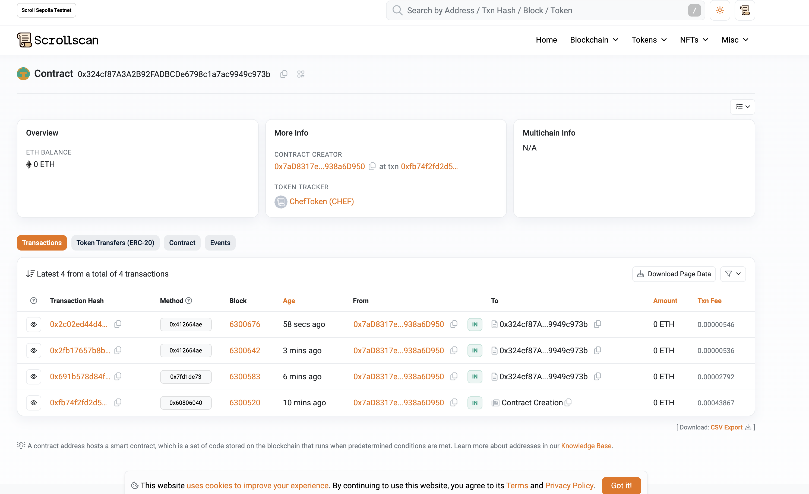

[](https://github.com/susumutomita/ETHTokyo2024/actions/workflows/contract_ci.yml)


<div style="text-align: center;">
  
</div>


**ChefConnect** is a decentralized Web3 platform that allows chefs to offer catering services on an individual basis. ChefConnect manages transactions, payments, reviews, and other operations using a transparent blockchain-based system.

## Table of Contents

- [Table of Contents](#table-of-contents)
- [Features](#features)
- [Technologies Used](#technologies-used)
- [System Overview](#system-overview)
- [Screenshots](#screenshots)
- [Installation](#installation)
- [Usage](#usage)
- [Deployment](#deployment)
  - [Deploying to Scroll Testnet](#deploying-to-scroll-testnet)
  - [Verifying Deployed Contracts on Scroll Testnet](#verifying-deployed-contracts-on-scroll-testnet)
  - [Deployed Contract Information](#deployed-contract-information)
  - [Deploying to BNB Testnet](#deploying-to-bnb-testnet)
- [Future Prospects](#future-prospects)
- [Contributing](#contributing)
- [License](#license)
- [The Team](#the-team)

## Features

- **Direct Interaction between Chefs and Customers**: ChefConnect allows chefs to accept catering orders individually, with transactions and contracts managed through automated smart contracts.
- **Token-Based Loyalty Program**: Users earn tokens for each transaction, which can be redeemed for discounts, access to exclusive menus, or traded on secondary markets.
- **Decentralized Review System**: All reviews and ratings are stored on the blockchain, ensuring they are tamper-proof and trustworthy. Only verified purchasers can leave reviews.
- **Integration with BNB Chain Ecosystem**: Leverages the fast and low-cost transactions of the BNB Chain, along with Greenfield for secure data storage, enabling seamless interaction with other decentralized applications.
- **Regional Tokens for Local Economies**: Tokens specific to different regions can be issued, promoting local economic growth.
- **NFT-Based Special Offers**: Chefs can offer limited-time menu items or special promotions as NFTs, which users can purchase, trade, or redeem.

## Technologies Used

- **Blockchain**: Utilizes BNB Chain for transaction processing and smart contract execution.
- **Smart Contracts**: Developed using Solidity to manage orders, payments, loyalty rewards, and governance.
- **Web3 Wallet Integration**: Supports MetaMask and WalletConnect for secure payment processing and NFT management.
- **Frontend Development**: Built using Next.js for an interactive and user-friendly interface.
- **Backend and On-Chain App**: Backend logic is processed through smart contracts, functioning as an on-chain application.

## System Overview

ChefConnect combines various Web3 technologies to build a decentralized ecosystem for catering orders. It uses BNB Chain-based smart contracts for secure transactions and decentralized storage solutions for data integrity. Tokenomics enhance user engagement and loyalty, while NFTs offer unique customer experiences such as special menu items and exclusive offers.

## Screenshots


## Installation

To set up the development environment locally:

1. Clone the repository:

    ```bash
    git clone https://github.com/susumutomita/ETHTokyo2024.git
    ```

2. Install dependencies:

    ```bash
    make install
    ```

3. Start the local development server:

    ```bash
    make dev
    ```

Make sure you have a Web3 wallet like MetaMask installed and configured to interact with the BNB Chain test network.

## Usage

1. Connect your Web3 wallet (MetaMask or WalletConnect).
2. Browse menus from participating chefs and catering services.
3. Earn tokens with each order and use them for discounts or special offers.
4. Vote

## Deployment

### Deploying to Scroll Testnet

To deploy the CateringEscrow contract to the Scroll Testnet, use the following command:

```bash
make deploy-scroll
```

This command uses the `SCROLL_RPC_URL`, `SCROLL_SENDER_ADDRESS`, and `SCROLL_PRIVATE_KEY` environment variables specified in your `.env` file.

### Verifying Deployed Contracts on Scroll Testnet

After deploying to the Scroll Testnet, you can verify the contract using ScrollScan:

1. Visit the [ScrollScan](https://sepolia.scroll.io) for the Scroll Testnet.
2. Enter your deployed contract address to view transaction details and logs.

### Deployed Contract Information

**Scroll Testnet**

- **Contract Address**: `0x324cf87A3A2B92FADBCDe6798c1a7ac9949c973b`
- **ScrollScan Link**: [View Contract on ScrollScan](https://sepolia.scrollscan.com/address/0x324cf87A3A2B92FADBCDe6798c1a7ac9949c973b)
- **Transaction Hash**: `0xfb74f2fd2d570b7e2e0ec3b274886908a171b3a08f077b560372d4353f099f25`



**BNB Testnet**

- **Contract Address**: `0x74Ba9DC4ad8a89a9dcbB51D8a91E787096ED3E6F`
- **BscScan Link**: [View Contract on BscScan](https://testnet.bscscan.com/address/0x74Ba9DC4ad8a89a9dcbB51D8a91E787096ED3E6F)
- **Transaction Hash**: `0x4cd249e17aea14740d1b8b0796fe7e272683327a3180badd93a8ec3e899fe93e`


### Deploying to BNB Testnet

To deploy the CateringEscrow contract to the BNB Testnet, use the following command:

```bash
make deploy-bnb
```

Ensure that you have set the correct RPC URL and private key in your `.env` file.

## Future Prospects

- **Full Catering Workflow**: Book, serve, and get paid.
- **Enhanced Governance**: Community-driven decisions.

## Contributing

We welcome contributions from the community. To contribute:

1. Fork the repository.
2. Create a new branch: `git checkout -b feature-name`
3. Make your changes and commit them: `git commit -m 'Add some feature'`
4. Push to the branch: `git push origin feature-name`
5. Submit a pull request.

## License

This project is licensed under the MIT License. See the [LICENSE](LICENSE) file for details.

## The Team

- [Susumu Tomita](https://susumutomita.netlify.app/) - Full Stack Developer
