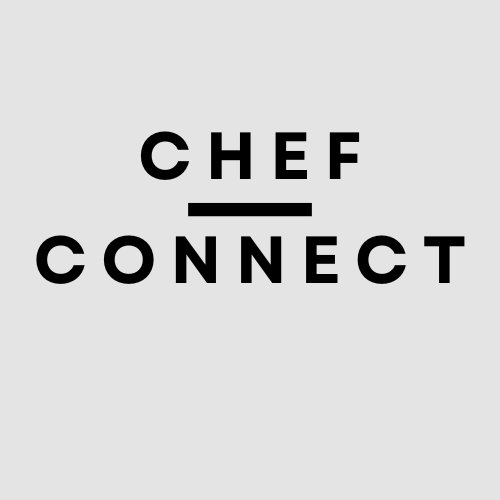

### Connecting Individual Chefs Directly with Customers

---

## Problem Statement

**Make catering accessible for individual chefs.**

---

## What We Made

- **ChefConnect**: A platform for chefs to connect with customers directly.
- **Features**:
  - **Secure Payments**: Smart contracts handle all payments.
  - **Loyalty Tokens**: Earn and redeem tokens.
  - **Trusted Reviews**: Reviews are stored on the blockchain.

---

## How It Works

1. **Chef Profiles**: Chefs create their profiles.
2. **Smart Contracts**: Automate payments and agreements.
3. **Token Rewards**: Earn tokens for transactions.
4. **On-Chain Reviews**: Real feedback, no fakes.

---

## Demo

---

## Tech Stacks

- **Blockchain**: BNB Chain and Scroll Testnet.
- **Frontend**: Next.js with MetaMask.
- **Tokens**: ERC20 tokens for loyalty.

---

## Future Works

- **Full Catering Workflow**: Book, serve, and get paid.
- **Enhanced Governance**: Community-driven decisions.

---

## Thank You
